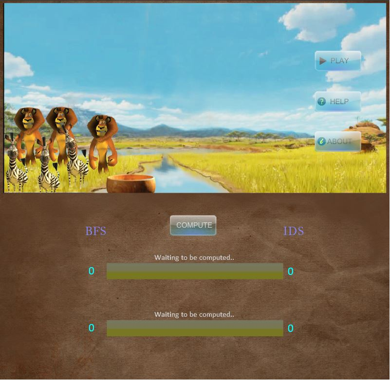
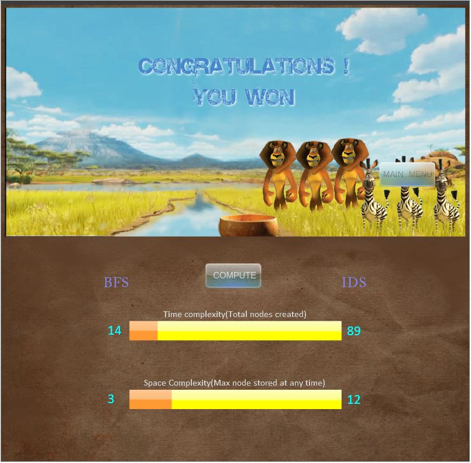

**How to play:**
1. You need to have adobe flash player. Otherwise, install it from adobe’s [official site](https://get.adobe.com/flashplayer/).
2. Download the *cannibal.swf* file.
3. Double click on the swf file to run it (you may need to give permission to run flash player)
4. If clicking does not run the file, just go to http://flashplayer.fullstacks.net/ and upload the .swf file. Set size as 800 by 800px (like before, may need to permit web browser to run flash content).

**Personal notes:** I made it long before (in 2010) using adobe flash and actionscript 3.0. It was an assignment in the advanced programming course where we needed to programmatically represent and solve the problem as well as show the intermediate steps for the solution. However, I felt that it would be nice and fun to make it in forms of an actual game. The heuristic algorithms (below the game canvas) were also implemented in actionscipt.

The characters are taken from my favorite movie Madagascar!

I hope you will enjoy the game! And don't let Alex (:lion:) bite Marty (:horse:)!!

**Screenshot 1: Home Screen**

**Screenshot 2: Win Screen**
